# Data Model

All tables live in one SQLite database, WAL mode enabled for
concurrent readers during writes. Binary photo/video data is **not**
stored as BLOB columns — it is written to a private directory on disk
and the DB stores a path/hash/metadata reference. This keeps the DB
small, backup-friendly, and lets the file layer apply its own access
control (see `05-security-and-privacy.md`).

Timestamps are stored as UTC Unix epoch integers (seconds) unless
noted. IDs are UUIDv4 text unless noted (avoids leaking row counts,
safe to use in URLs).

## 1. Entity-relationship overview

```mermaid
erDiagram
    USERS ||--o| KEYHOLDER_PROFILES : "has"
    USERS ||--o| SUBMISSIVE_PROFILES : "has"
    USERS ||--o{ INVITES : "creates (as keyholder)"
    USERS ||--o{ KEYHOLDER_SUBMISSIVE_LINKS : "keyholder_id"
    USERS ||--o{ KEYHOLDER_SUBMISSIVE_LINKS : "submissive_id"
    KEYHOLDER_SUBMISSIVE_LINKS ||--o{ CHASTITY_DEVICES : "for submissive"
    CHASTITY_DEVICES ||--o{ CONFINEMENT_SESSIONS : "tracks"
    KEYHOLDER_SUBMISSIVE_LINKS ||--o| VERIFICATION_POLICIES : "governs"
    VERIFICATION_POLICIES ||--o{ VERIFICATION_CODES : "issues"
    VERIFICATION_CODES ||--o| PROOF_SUBMISSIONS : "redeemed by"
    PROOF_SUBMISSIONS ||--o{ PROOF_ATTACHMENTS : "has"
    PROOF_SUBMISSIONS ||--o| PROOF_SUBMISSIONS : "redo_of (self ref)"
    USERS ||--o{ REWARD_PUNISHMENT_TEMPLATES : "authored by keyholder"
    REWARD_PUNISHMENT_TEMPLATES ||--o| REWARD_PUNISHMENT_TEMPLATES : "on_success / on_failure (self ref)"
    KEYHOLDER_SUBMISSIVE_LINKS ||--o{ ASSIGNMENTS : "reward/punishment/task instances"
    REWARD_PUNISHMENT_TEMPLATES ||--o{ ASSIGNMENTS : "instantiates"
    PROOF_SUBMISSIONS ||--o| ASSIGNMENTS : "triggered by / completion proof for (nullable)"
    PLAY_SESSIONS ||--o{ ASSIGNMENTS : "judgement triggers (nullable)"
    ASSIGNMENTS ||--o| ASSIGNMENTS : "escalated_from (self ref)"
    KEYHOLDER_SUBMISSIVE_LINKS ||--o{ POINT_TRANSACTIONS : "optional points ledger"
    REWARD_PUNISHMENT_TEMPLATES ||--o{ REWARD_REDEMPTION_REQUESTS : "redeemable reward"
    REWARD_REDEMPTION_REQUESTS ||--o| ASSIGNMENTS : "approved into (nullable)"
    KEYHOLDER_SUBMISSIVE_LINKS ||--o{ TOYS : "catalog"
    USERS ||--o{ TOYS : "added_by"
    USERS ||--o{ CHECKIN_TEMPLATES : "authored by keyholder"
    CHECKIN_TEMPLATES ||--o{ CHECKIN_TEMPLATE_FIELDS : "custom fields"
    CHECKIN_TEMPLATES ||--o{ CHECKINS : "instantiates"
    KEYHOLDER_SUBMISSIVE_LINKS ||--o{ CHECKINS : "logged for"
    USERS ||--o{ PLAY_SESSION_TEMPLATES : "authored by keyholder"
    PLAY_SESSION_TEMPLATES ||--o{ PLAY_SESSIONS : "instantiates"
    KEYHOLDER_SUBMISSIVE_LINKS ||--o{ PLAY_SESSIONS : "assigned to"
    PLAY_SESSIONS ||--o{ PLAY_SESSION_TOYS : "toys used"
    TOYS ||--o{ PLAY_SESSION_TOYS : "used in"
    PLAY_SESSIONS ||--o{ CHECKINS : "mid-session"
    PLAY_SESSIONS ||--o{ PLAY_SESSION_CHECKIN_SCHEDULE : "planned check-in slots"
    CONFINEMENT_SESSIONS ||--o{ CONFINEMENT_ADJUSTMENTS : "timer changes"
    ASSIGNMENTS ||--o{ CONFINEMENT_ADJUSTMENTS : "caused (time-extension effect)"
    USERS ||--o{ AUDIT_LOG : "actor"
    USERS ||--o{ SAFETY_ALERTS : "raised by submissive"
    USERS ||--o{ SESSIONS : "authenticates"
    USERS ||--o| TWO_FACTOR_CREDENTIALS : "optional"
    USERS ||--o{ TWO_FACTOR_RECOVERY_CODES : "backup codes"
    USERS ||--o{ TWO_FACTOR_LOGIN_CHALLENGES : "pending second factor"
    USERS ||--o{ API_TOKENS : "issued to (keyholder)"
    USERS ||--o{ PUSH_SUBSCRIPTIONS : "registered device"
    USERS ||--o{ NOTIFICATIONS : "recipient"
    USERS ||--o{ IDEMPOTENCY_KEYS : "scoped to"
```

## 2. Core identity

### `users`
| column | type | notes |
|---|---|---|
| id | TEXT PK (uuid) | |
| email | TEXT UNIQUE | login identifier |
| password_hash | TEXT | Argon2id |
| role | TEXT CHECK IN ('keyholder','submissive') | immutable after creation |
| display_name | TEXT | shown in UI, not the login identifier |
| created_at | INTEGER | |
| disabled_at | INTEGER NULL | soft-disable instead of delete |
| failed_login_count | INTEGER DEFAULT 0 | lockout support |
| locked_until | INTEGER NULL | lockout support |

A single `users` table with a `role` discriminator, rather than two
separate tables, keeps auth/session code uniform. Role-specific data
lives in the profile tables below.

### `keyholder_profiles`
| column | type | notes |
|---|---|---|
| user_id | TEXT PK/FK -> users.id | |
| bio | TEXT NULL | |
| contact_info | TEXT NULL | free text, keyholder-controlled |
| timezone | TEXT NULL | for scheduling verification windows |
| hard_limits | TEXT NULL | the Keyholder's own absolute boundaries — tasks, punishments, or activities they will not assign/engage in, regardless of context |
| soft_limits | TEXT NULL | the Keyholder's own boundaries that require extra care, negotiation, or context before they'll apply them |

### `submissive_profiles`
| column | type | notes |
|---|---|---|
| user_id | TEXT PK/FK -> users.id | |
| bio | TEXT NULL | submissive-editable |
| safeword | TEXT NULL | submissive-editable, keyholder can view |
| hard_limits | TEXT NULL | submissive-editable — absolute boundaries the Keyholder must never cross, regardless of context or prior consent given elsewhere |
| soft_limits | TEXT NULL | submissive-editable — boundaries that are conditional/negotiable rather than absolute |
| emergency_contact | TEXT NULL | optional, submissive-editable |
| keyholder_notes | TEXT NULL | **keyholder-editable only**, hidden from submissive view — private assessment field |
| timezone | TEXT NULL | |

`keyholder_notes` is intentionally writable only by the linked
Keyholder and never returned to the submissive's own profile fetch —
this is enforced at the API/service layer, not just the UI.

`hard_limits`/`soft_limits` are free-text fields in v1, the same
level of structure as `safeword`/`emergency_contact` — this is
negotiated, personal, prose content, not something the application
needs to parse or programmatically enforce today (see
`06-future-extensions.md` for the case, deferred for now, of turning
this into a structured itemized checklist). They exist on **both**
profile tables because either party's boundaries matter, and —
unlike `keyholder_notes`, which is a one-directional private
assessment — limits are mutually visible: each person edits only
their own, but a Keyholder can read their linked submissive's limits
and that submissive can read their own Keyholder's limits right back
(see `02-roles-and-permissions.md` §2). This mirrors how limits
actually function in the dynamic itself — they only do their job as a
safety mechanism if both sides can see what the other has drawn a
line at, whereas `keyholder_notes` is deliberately one-directional
because it's the Keyholder's private assessment, not a boundary
either party needs to see to stay safe.

`safeword` remains submissive-only rather than duplicated onto
`keyholder_profiles`: it's the word the submissive uses to signal the
Keyholder to stop, so conceptually it belongs to the person who
invokes it. If a future need arises for the Keyholder to record their
own separate signal/response word, that's a straightforward additive
column, not a redesign.

### `sessions`
Backs the server-side session-cookie auth described in
`05-security-and-privacy.md` §2 — referenced there since that
document was written first, formalized here as an actual table
(closing a gap where it was described but never modeled).

| column | type | notes |
|---|---|---|
| id | TEXT PK | the opaque value carried in the session cookie |
| user_id | TEXT FK -> users.id | |
| created_at | INTEGER | |
| last_seen_at | INTEGER | updated (throttled, e.g. at most once/minute) on each authenticated request |
| expires_at | INTEGER | absolute expiry; refreshed forward on activity up to a max lifetime, not extended indefinitely |
| user_agent | TEXT NULL | shown back to the user so `GET /auth/sessions` can label devices ("Chrome on macOS") — see `10-operations.md` §1 |
| revoked_at | INTEGER NULL | set by explicit logout, by `DELETE /auth/sessions/{id}`, or by a password change (which revokes every *other* session — see `10-operations.md` §1) |

A row here is deleted (not just marked revoked) once it's both
`revoked_at IS NOT NULL` and past `expires_at`, on a simple periodic
cleanup — there's no accountability reason to keep a dead session
row forever the way there is for e.g. a revoked API token.

### `two_factor_credentials`
Optional, opt-in, either role. One row per user — setting it up again
before confirming replaces the pending row rather than erroring,
since a stalled setup (scanned the QR code, closed the tab) is more
useful to let someone retry than to make them explicitly cancel first.

| column | type | notes |
|---|---|---|
| user_id | TEXT PK/FK -> users.id | |
| secret | TEXT | base32 TOTP secret. Stored in the clear, unlike a password — the server has to be able to *compute* the current code to check a login attempt against it, so this can't be a one-way hash the way `password_hash` is. See `05-security-and-privacy.md` §2 for what that implies |
| confirmed_at | INTEGER NULL | NULL = setup started (secret generated, QR code shown) but not yet confirmed with a valid code — 2FA is **not** enforced on login while NULL. Set once `POST /auth/2fa/confirm` validates the first code |
| created_at | INTEGER | |

### `two_factor_recovery_codes`
Generated once, all at once, the moment `confirmed_at` is set — the
same "shown once, only the hash kept" pattern as invite tokens and
API tokens, since these are exactly that: a set of one-time-use
backup credentials.

| column | type | notes |
|---|---|---|
| id | TEXT PK | |
| user_id | TEXT FK -> users.id | |
| code_hash | TEXT | SHA-256 — same reasoning as `api_tokens.token_hash` (§9): high-entropy generated value, not a human-chosen secret, doesn't need Argon2-style stretching |
| used_at | INTEGER NULL | a code is consumed (not deleted) on use, same "keep the history" instinct as everywhere else in this schema — a used recovery code still shouldn't work twice, and its `used_at` is itself a useful signal ("someone used a backup code recently") |
| created_at | INTEGER | |

### `two_factor_login_challenges`
The gap between "password was correct" and "session issued" when 2FA
is enabled — a short-lived, single-purpose, server-tracked
intermediate state, following the same "opaque DB-backed token, not a
signed stateless one" preference as sessions and API tokens
(`05-security-and-privacy.md` §2).

| column | type | notes |
|---|---|---|
| id | TEXT PK | the opaque token returned to the client as `challenge_token` |
| user_id | TEXT FK -> users.id | |
| created_at | INTEGER | |
| expires_at | INTEGER | short — a few minutes, not a session-length window |
| attempts | INTEGER DEFAULT 0 | incremented on each wrong code; the row is deleted outright once this hits a small limit (e.g. 5), forcing a fresh login rather than allowing indefinite guessing against one challenge |

A row here is deleted once it's used successfully, expires, or hits
the attempt limit — it never needs to persist past that, unlike
`sessions`/`api_tokens` where the historical record itself has value.

### `invites`
Keyholders create submissive accounts via invite token rather than
open self-registration, so every submissive is linked to a Keyholder
at creation time and nobody can sign up unassigned.

| column | type | notes |
|---|---|---|
| id | TEXT PK | |
| token_hash | TEXT | the raw token is shown once, only the hash is stored |
| created_by_keyholder_id | TEXT FK -> users.id | |
| expires_at | INTEGER | short-lived, e.g. 24-72h |
| used_at | INTEGER NULL | |
| used_by_user_id | TEXT NULL FK -> users.id | |

### `password_reset_tokens`
Same shape as `invites` — a single-use, hashed-at-rest, short-lived
token — but backing account recovery rather than account creation.
Two issuance paths now exist, distinguished by `requested_via`:
`owners-cock-ledger admin reset-password <email>`
(`10-operations.md` §5, always available, no configuration needed),
and, if the deployer has configured an outbound SMTP relay
(`05-security-and-privacy.md` §11), self-service via
`POST /auth/password-reset/request` (`03-api-design.md` §1). Both
converge on the same table and the same redeem endpoint — the
account holder always sets their own new password either way, the
only difference is who triggered the token's creation.

| column | type | notes |
|---|---|---|
| id | TEXT PK | |
| user_id | TEXT FK -> users.id | |
| token_hash | TEXT | SHA-256, same reasoning as `api_tokens.token_hash` (§9) |
| requested_via | TEXT CHECK IN ('admin_cli','self_service') | which path created this row — visible to a Keyholder reviewing their own account's audit trail, same instinct as `assigned_via`/`reviewed_via` elsewhere in this schema |
| created_at | INTEGER | |
| expires_at | INTEGER | short — on the order of 1 hour either way: handed to the account holder immediately over whatever channel the admin already has open for `admin_cli`, or delivered by email within seconds for `self_service` — neither case benefits from a longer window |
| consumed_at | INTEGER NULL | |

## 3. Keyholder ↔ submissive relationship

### `keyholder_submissive_links`
This is the join table that establishes ownership and drives nearly
every authorization check in the system.

| column | type | notes |
|---|---|---|
| id | TEXT PK | |
| keyholder_id | TEXT FK -> users.id | |
| submissive_id | TEXT FK -> users.id | |
| status | TEXT CHECK IN ('active','paused','ended') | |
| started_at | INTEGER | |
| ended_at | INTEGER NULL | |
| UNIQUE | (submissive_id) WHERE status = 'active' | enforced in app logic (SQLite partial-unique index) — a submissive has at most one *active* keyholder at a time |

Design choice: a submissive may have historical links to more than
one Keyholder over time (dynamics end, new ones begin), but only one
`active` link at once. This keeps the common case simple (single
owner) while still allowing the relationship to end and reform
without deleting history. See `06-future-extensions.md` for the
co-keyholder case this deliberately does not support yet.

Every domain table below that is "per submissive" is scoped through
this link, and a Keyholder's queries are always filtered by
`keyholder_submissive_links.keyholder_id = <current user> AND status = 'active'`
(or including 'paused'/'ended' explicitly when viewing history).

## 4. Chastity status tracking

### `chastity_devices`
A submissive may own/use more than one physical device over time.

| column | type | notes |
|---|---|---|
| id | TEXT PK | |
| submissive_id | TEXT FK -> users.id | |
| name | TEXT | e.g. "steel #2" |
| description | TEXT NULL | |
| added_at | INTEGER | |
| retired_at | INTEGER NULL | |

### `confinement_sessions`
The actual status timeline. "Current status" is derived, not stored
redundantly: a submissive is *locked* iff there exists a row with
`ended_at IS NULL`. This table also carries the **planned** duration —
"how long they are supposed to be locked" — as distinct from
`ended_at`, which only ever reflects when they were *actually*
unlocked.

| column | type | notes |
|---|---|---|
| id | TEXT PK | |
| submissive_id | TEXT FK -> users.id | |
| device_id | TEXT FK -> chastity_devices.id | |
| started_at | INTEGER | |
| ended_at | INTEGER NULL | NULL = currently locked |
| target_release_at | INTEGER NULL | the planned/expected unlock time — a countdown target, not an enforcement mechanism (see below). NULL = no target set (open-ended) |
| clock_paused_at | INTEGER NULL | see below — the Keyholder freezing this session's countdown. NULL = running normally |
| clock_pause_message | TEXT NULL | the Keyholder's own note shown to the submissive while paused (e.g. "traveling for work, back Friday"). Meaningful only while `clock_paused_at IS NOT NULL`; NULL the rest of the time |
| started_reason | TEXT | enum-like: `scheduled`,`punishment`,`voluntary`,`other` |
| ended_reason | TEXT NULL | enum-like: `scheduled_release`,`reward`,`emergency`,`keyholder_decision`,`other` |
| ended_by_user_id | TEXT NULL FK -> users.id | who recorded the unlock |
| notes | TEXT NULL | |
| UNIQUE | (submissive_id) WHERE ended_at IS NULL | enforced in app logic (SQLite partial-unique index), same pattern as `keyholder_submissive_links`' one-active-link constraint (§3) — a submissive can have at most one *open* confinement session at a time. Closes a gap where "409 if one is already open" (`03-api-design.md` §4) was previously the only thing preventing two open sessions; it now sits in front of a real constraint instead of being the sole guarantee. |

Only a Keyholder can write to this table for their linked
submissives in the baseline model (the Keyholder "holds the key," so
the system of record for lock/unlock events is Keyholder-entered).
A configurable-per-link flag (`self_report_allowed` on
`keyholder_submissive_links` or on a policy table) can let specific
Keyholders permit their submissive to self-report events instead —
default off. Either way every insert records `ended_by_user_id`/an
equivalent `started_by_user_id`, so the audit trail always shows who
asserted a status change.

`target_release_at` is the "how long they're *supposed* to be
locked" timer the Keyholder sets and can modify at any time (extend
or shorten) — it's a plan, not a lock: reaching it doesn't
automatically end the session or unlock anything (a physical device
can't be released by software), it just changes what the countdown
displayed to both roles shows. Actually ending confinement always
still requires an explicit `ended_at` write, same as today. Passing
the target while still locked is shown as "N overdue," not as an
error state or a failure — a Keyholder is free to decide the real
release happens later than originally planned.

`clock_paused_at` lets a Keyholder freeze that countdown outright —
the motivating case being genuine unavailability (travel, illness,
anything) where the required lock duration shouldn't quietly erode
while nobody's supervising. This is deliberately **not** the same
thing as `keyholder_submissive_links.status='paused'`, which pauses
the *administrative relationship* (blocks new manual Keyholder
actions) and is a completely different axis — a link can be `active`
with its clock paused, or `paused` with its clock still running; the
two answer different questions and are never meant to be conflated,
which is exactly why this lives as its own field on the session
rather than folded into that other enum. Full pause/resume mechanics
— in particular, what happens to `target_release_at` when the
Keyholder resumes — are in `08-punishments-and-deadlines.md` §9. This
field affects only the confinement countdown; it has no effect on
punishment deadlines, verification scheduling, or anything else in
the system — a deliberately narrow scope, not a first step toward a
broader "pause everything" mode.

`clock_pause_message` exists because "Paused" on its own is a
non-answer to the one question it immediately provokes — a submissive
staring at a frozen countdown deserves to know *why*, even briefly,
without that context having to travel entirely out-of-band (a text
message, a conversation) from the one place they're actually looking
at their status. It's plain free text, no structure needed, and it's
optional — a Keyholder can pause without one. Unlike most fields in
this schema it's designed to be **transient**: it lives on the
session only for the duration of the pause. On resume, its value is
copied into the `confinement_adjustments.notes` field of the
`reason='clock_pause'` row that resume creates (§ next), so the
message isn't lost — it becomes part of the permanent adjustment
history — and `clock_pause_message` itself is cleared back to NULL,
since once resumed there's no longer an active pause for it to
explain.

### `confinement_adjustments`
Every change to `target_release_at` is logged here, not just
overwritten in place — this is what lets both roles see *why* the
countdown moved, which matters once a punishment can move it
automatically (see `01-data-model.md` §6).

| column | type | notes |
|---|---|---|
| id | TEXT PK | |
| session_id | TEXT FK -> confinement_sessions.id | |
| delta_seconds | INTEGER | signed: positive extends, negative reduces |
| reason | TEXT CHECK IN ('manual','punishment_time_extension','clock_pause') | |
| caused_by_assignment_id | TEXT NULL FK -> assignments.id | set when `reason='punishment_time_extension'` — which punishment did this |
| adjusted_by_user_id | TEXT NULL FK -> users.id | the Keyholder, for `manual`; NULL for an automatic punishment-driven adjustment (the "actor" there is the system applying a Keyholder-configured consequence, not a Keyholder click in the moment — see `01-data-model.md` §6) |
| adjusted_at | INTEGER | |
| notes | TEXT NULL | Keyholder's reason, for `manual` adjustments; for `clock_pause`, copied from the session's `clock_pause_message` at resume time (§4) — the pause message becomes this row's permanent record once the pause ends |
| keyholder_reviewed_at | INTEGER NULL | see below — always set at insert time for `reason='manual'` (there's nothing to review, the Keyholder just did it themselves); starts NULL for `reason='punishment_time_extension'` until the Keyholder acts on it; always set at insert time for `reason='clock_pause'` too (the Keyholder just resumed it themselves — same reasoning as `manual`) |

`reason='clock_pause'` is inserted automatically on **resume**, not on
pause — pausing itself doesn't move `target_release_at` at all (see
`08-punishments-and-deadlines.md` §9); it's the act of resuming that
computes how long the pause lasted and extends the target by exactly
that much, recorded here the same way any other delta is, so "why is
my time longer" always has one answer whether the cause was a
punishment, a manual edit, or time spent paused.

A Keyholder's `PATCH` to the confinement status (§4 in
`03-api-design.md`) never overwrites `target_release_at` directly —
it computes a `delta_seconds` and inserts a row here, then applies
that delta to the session's `target_release_at`, so "why is my time
2 days longer than last week" always has an answer on the
submissive's own timeline, not just in the generic audit log.

`keyholder_reviewed_at` exists because an automatic
`punishment_time_extension` adjustment happens with **no Keyholder
click in the moment** — it fires off a pre-configured
`time_extension_seconds` value (`01-data-model.md` §6), which
defaults to 6 hours when a Keyholder first creates a time-extension
template rather than requiring them to pick a number up front. A
sensible default applied automatically is still a real consequence
landing on the submissive without a human deciding "6 hours, right
now, is correct" — so rather than trusting the default silently
forever, every such adjustment is flagged unreviewed until the
Keyholder either confirms it (`PATCH .../timer-adjustments/{id}/review`,
`03-api-design.md` §4) or corrects it with a follow-up manual delta,
which marks it reviewed as a side effect. See
`08-punishments-and-deadlines.md` §6 for the notification that tells
the Keyholder this happened and prompts the review, and
`06-future-extensions.md` for why the default is a flat constant
today rather than something more sophisticated.

## 5. Verification policy, codes, and proof

### `verification_policies`
One active policy per link; keyholder-authored, but never absent —
a default row (`frequency_kind='on_demand_only'`, 15 min TTL, 10 min
grace) is created automatically when the link itself is created, so
there's no undefined window before a Keyholder configures a real
schedule. See `04-verification-workflow.md` §1.

| column | type | notes |
|---|---|---|
| id | TEXT PK | |
| link_id | TEXT FK -> keyholder_submissive_links.id | |
| frequency_kind | TEXT | `interval_hours`, `fixed_times_daily`, `random_within_window`, `on_demand_only` |
| frequency_value | TEXT | JSON, shape depends on `frequency_kind` (e.g. `{"hours":24}` or `{"times":["09:00","21:00"]}`) |
| code_ttl_seconds | INTEGER | how long an issued code stays valid, e.g. 900 |
| grace_period_seconds | INTEGER | how late a submission can land and still count as on-time |
| created_at | INTEGER | |
| updated_at | INTEGER | |

### `verification_codes`
Server-generated, time-bound, single-use codes the submissive must
display in their proof photo (e.g. handwritten on paper, or shown on
a second screen in frame).

| column | type | notes |
|---|---|---|
| id | TEXT PK | |
| link_id | TEXT FK -> keyholder_submissive_links.id | |
| code | TEXT | short human-writable string, e.g. 6-8 alphanumeric chars, generated with a CSPRNG — not a guessable sequential value |
| issued_at | INTEGER | |
| expires_at | INTEGER | `issued_at + policy.code_ttl_seconds` |
| consumed_at | INTEGER NULL | set when a proof submission redeems it |
| consumed_by_submission_id | TEXT NULL FK -> proof_submissions.id | |

A code can be system-issued on the policy's schedule, or
submissive-requested on demand (`on_demand_only` policies, or a
"prove now" button always available in addition to the schedule).
Codes are single-use: once `consumed_at` is set, requesting a new
code is required. This is what prevents a submissive from
pre-generating a batch of photos.

### `proof_submissions`
The generalized record — "not just photo proof but other info also
can be saved" is handled by `kind` + `metadata` (JSON) + the separate
attachments table, rather than a photo-only schema.

| column | type | notes |
|---|---|---|
| id | TEXT PK | |
| submissive_id | TEXT FK -> users.id | |
| link_id | TEXT FK -> keyholder_submissive_links.id | denormalized for query convenience |
| purpose | TEXT CHECK IN ('verification','punishment_completion') | default `'verification'` — what this submission is proof *of*. See §6 for `punishment_completion` |
| verification_code_id | TEXT NULL FK -> verification_codes.id | null for ad-hoc/unscheduled notes, and always null when `purpose='punishment_completion'` (completing a punishment isn't gated by a time-boxed code — the punishment's own `deadline_at` does that job instead, see §6) |
| verification_code_value | TEXT NULL | **snapshot** of `verification_codes.code` at the moment this submission redeemed it — see rationale below |
| assignment_id | TEXT NULL FK -> assignments.id | set when `purpose='punishment_completion'` — which punishment this proves completion of. Mirrors `assignments.proof_submission_id` (§6), which points back the other way; both sides are kept in sync in the same transaction |
| kind | TEXT | `photo`,`video`,`note`,`mixed` |
| metadata | TEXT (JSON) | freeform structured data: device status claimed, mood, session reference, etc. |
| submitted_at | INTEGER | |
| status | TEXT CHECK IN ('pending','verified','redo','failed') | default `pending` |
| reviewed_by_user_id | TEXT NULL FK -> users.id | |
| reviewed_at | INTEGER NULL | |
| review_notes | TEXT NULL | |
| reviewed_via | TEXT NULL CHECK IN ('session','api_token') | how the review request was authenticated — see rationale below |
| redo_of_submission_id | TEXT NULL FK -> proof_submissions.id | chains a resubmission back to the one it's redoing, for a full audit trail |

`purpose` exists so the same review mechanism (§4 in
`04-verification-workflow.md`, and the review endpoint in
`03-api-design.md` §6) can serve two conceptually different things —
"prove you're still locked" and "prove you carried out this specific
punishment" — without needing two parallel submission/review
pipelines. A Keyholder's review queue can filter by `purpose` when
that distinction matters for how they triage it, but the underlying
verified/redo/failed mechanics, attachment handling, and
`reviewed_via` accountability are identical either way.

`reviewed_via` exists because `06-future-extensions.md` §5 commits to
verification being a **human** judgment call in this system — no
automated code-reading, no auto-approve. Keyholder API tokens
(§9 below) make it technically possible for a Keyholder to script
their own review decisions (e.g. an OCR bot that reads the code and
calls the review endpoint). That's the Keyholder's prerogative, not
something the platform can or should police, but it does mean the
"a person looked at this" guarantee is no longer structural once
tokens with the review scope exist — so the fact of *how* a review
happened needs to be visible on the record itself, not buried in the
audit log, since anyone actually relying on "verified means a human
saw it" (the Keyholder themself, later) needs an at-a-glance way to
tell the two apart.

`verification_code_value` is a deliberate denormalization, copied
from `verification_codes.code` in the same transaction that consumes
the code (see `04-verification-workflow.md` §3). The row keeps its
own foreign key (`verification_code_id`) too, but the *value* the
submissive actually wrote/displayed in the photo is stored directly
on the submission — the same "copy at write time" pattern already
used for `assignments.title`/`description` in §6, and for the same
reason: the proof record (code + picture, together) needs to stand
on its own permanently, independent of whatever retention or
rotation policy the `verification_codes` table itself ends up with,
and independent of any future change to how codes are generated.
This is what makes a submission a **self-contained** piece of
evidence — a Keyholder (or the audit log) can always see, on the
submission itself, exactly which code was expected to appear in that
specific picture, without a join. It's a plaintext copy, which is
fine from a security standpoint: by the time it's stored, the code
has already been consumed (single-use) and is no longer capable of
authorizing anything (see `05-security-and-privacy.md` §5).

### `proof_attachments`
One submission can carry multiple files (e.g. two angles, or a photo
+ a short video).

| column | type | notes |
|---|---|---|
| id | TEXT PK | |
| submission_id | TEXT FK -> proof_submissions.id | |
| storage_path | TEXT | path on disk, randomized filename (uuid + extension) |
| original_filename | TEXT NULL | kept for the Keyholder's reference only |
| mime_type | TEXT | |
| byte_size | INTEGER | |
| sha256 | TEXT | integrity check, also de-dupes accidental double-uploads |
| uploaded_at | INTEGER | |

## 6. Rewards, punishments, and tasks

**Revised in this pass** — `11-tasks-and-rewards.md`'s research
exposed that the original design's `kind='punishment',
effect_kind='task'` and a genuinely *neutral* assignable task were
the same shape with one path missing: a punishment-as-task could only
escalate to something worse, never resolve into something good. Once
a task can be *either* a punitive assignment or a proactively-offered
one with its own reward for success, "punishment that happens to
require a task" and "task" stopped being two concepts. Rather than
carry both, `kind` gains a third value and `effect_kind='task'` moves
out from under `kind='punishment'` entirely:

- **`kind='reward'`** — an immediate, keyholder-granted positive
  consequence. No task, no deadline, no proof. (Optionally an
  immediate *timer* reward — see `effect_kind` below.)
- **`kind='punishment'`** — an immediate, keyholder-applied negative
  consequence. Also no task, no deadline, no proof — this is
  deliberately narrower than it was before this revision; anything
  that requires the submissive to *do* something now lives under
  `kind='task'` instead, whether it originated punitively or not.
- **`kind='task'`** — an assignable activity requiring acknowledgment
  or proof (photo/video/voice, `11-tasks-and-rewards.md` §1), on a
  deadline, with **two** independent escalation paths: what happens
  on success (`on_success_template_id`, typically a reward) and what
  happens on failure (`on_failure_template_id`, typically a
  punishment or another task). A task assigned *as* a punishment
  (e.g. "500 lines") simply leaves `on_success_template_id` NULL —
  nothing rewards you for doing your punishment — while a
  proactively-offered task ("clean the whole apartment by Sunday,
  video required") can set both paths.

This asymmetry between `reward`/`punishment` (immediate, no task) and
`task` (deferred, tracked, dual-path) is deliberate, not an
inconsistency: an immediate consequence has nothing to enforce, so it
doesn't need any of this machinery; anything requiring the submissive
to act, by a deadline, with a consequence either way, is a `task`
regardless of whether it originated as a reward opportunity or a
punishment. Full task workflow (multi-media proof, points, the
research behind `on_success_template_id`) is in
`11-tasks-and-rewards.md`; this section stays the schema reference.

### `reward_punishment_templates`
The reusable catalog a Keyholder builds up over time. For
`kind='task'`, a template is a **complete, reusable spec**: what
satisfying it requires, how long the submissive gets, and what
happens either way — so that assigning from a well-built catalog
never requires re-deciding those things per submissive. An ad-hoc
task (not from a template) has to specify the task-only columns
inline instead, at assignment time (`03-api-design.md` §7).

| column | type | notes |
|---|---|---|
| id | TEXT PK | |
| keyholder_id | TEXT FK -> users.id | |
| kind | TEXT CHECK IN ('reward','punishment','task') | |
| title | TEXT | |
| description | TEXT NULL | |
| severity | INTEGER NULL | optional ordering/weight, keyholder-defined scale |
| active | INTEGER (bool) | soft-hide without deleting (assignments keep referencing it) |
| created_at | INTEGER | |
| effect_kind | TEXT NULL CHECK IN ('grant','time_extension','time_reduction') | required for `kind IN ('reward','punishment')`, NULL/unused for `kind='task'` (a task's effect is determined by what it resolves *into* — its `on_success`/`on_failure` templates — not by a field on itself). `grant` = the plain "something nice happens" / "you're in trouble" case with nothing else to track (default for both kinds); `time_extension` (punishment-only) and `time_reduction` (reward-only) apply directly to the confinement countdown, mirror images of each other |
| completion_type | TEXT NULL CHECK IN ('acknowledge_only','proof_required') | **task-only**, required when `kind='task'` |
| proof_media_types | TEXT NULL (JSON array) | **task-only**, required when `completion_type='proof_required'` — which media type(s) satisfy this task, e.g. `["photo"]`, `["photo","video"]`, `["voice"]`. See `11-tasks-and-rewards.md` §1 for why voice recording is in scope alongside photo/video |
| default_deadline_seconds | INTEGER NULL | **task-only**, required when `kind='task'` — how long a submissive gets, from the moment it's assigned, to acknowledge/submit proof. e.g. `86400` for 24h. Copied into `assignments.deadline_at` at assignment time; a Keyholder can override the resulting deadline on a specific instance afterward |
| time_extension_seconds | INTEGER NULL | required when `effect_kind='time_extension'` (punishment) — how much time this adds to the target confinement countdown when applied. Pre-filled to `21600` (6h) as a starting default, per the existing review-on-apply workflow (`08-punishments-and-deadlines.md` §6) |
| time_reduction_seconds | INTEGER NULL | required when `effect_kind='time_reduction'` (reward) — how much time this removes from the confinement countdown when granted. The direct positive mirror of `time_extension_seconds`; see `11-tasks-and-rewards.md` §2 for why this needed its own review-on-apply treatment too, not just a negated delta |
| on_success_template_id | TEXT NULL FK -> reward_punishment_templates.id (self) | **task-only** — if this task resolves as completed/verified, an assignment from *this* template is automatically created next (typically `kind='reward'`, but any kind is technically allowed — see `11-tasks-and-rewards.md` §1 for why chaining task→task on success is left possible but not specially designed for yet). NULL = the Keyholder decides what, if anything, to grant, manually |
| on_failure_template_id | TEXT NULL FK -> reward_punishment_templates.id (self) | **task-only** — if this task ends up `failed` (deadline passed with nothing done, or a submitted proof was rejected), an assignment from *this* template is automatically created next. NULL = no automatic escalation; a Keyholder handles a failure of this one manually instead |
| points_delta | INTEGER NULL | optional, only meaningful if the Keyholder has points tracking turned on for this submissive (`11-tasks-and-rewards.md` §3) — how many points this template's assignment is worth. Positive by convention for rewards and task successes, negative for punishments and task failures, but not enforced as a sign constraint — a Keyholder could deliberately make a "reward" worth `-5` points if that's genuinely what they mean by it |
| points_cost | INTEGER NULL | **reward-only** (`kind='reward'`) — if set, a submissive with a sufficient `points_balance` can request to redeem this reward themselves (`reward_redemption_requests`, below), rather than only ever receiving it as a direct Keyholder grant. NULL = this reward is never self-redeemable, only ever hand-assigned |

Templates are keyholder-owned, not submissive-specific, so the same
catalog (including its escalation chains) can be reused across every
submissive linked to that Keyholder.

An escalation chain is just templates pointing at templates — a task
can point its `on_failure_template_id` at a punishment template with
`effect_kind='time_extension'`, and that leaf template has no further
escalation of its own, since an immediate `grant`/`time_extension`/
`time_reduction` effect resolves instantly and can't itself be
"failed" — a chain built this way naturally terminates rather than
needing a depth limit enforced in code. A chain can also go
task → task → punishment, or task → reward on success and a
completely separate task → punishment on failure; the Keyholder
designs the ladder once, in the catalog.

### `assignments`
An actual instance of a reward, punishment, or task given to a
specific submissive, optionally tied to the verification event (or
play session, `14-play-sessions.md` §4) that triggered it, or to
another assignment that escalated into it.

| column | type | notes |
|---|---|---|
| id | TEXT PK | |
| link_id | TEXT FK -> keyholder_submissive_links.id | |
| template_id | TEXT NULL FK -> reward_punishment_templates.id | null if created ad-hoc and not saved to the catalog |
| kind | TEXT CHECK IN ('reward','punishment','task') | denormalized from template for ad-hoc rows |
| title | TEXT | copied at assignment time (so later edits/deletes of the template don't rewrite history) |
| description | TEXT NULL | copied at assignment time, may be customized per-assignment |
| effect_kind | TEXT NULL CHECK IN ('grant','time_extension','time_reduction') | copied from the template or set inline for an ad-hoc reward/punishment. NULL for `kind='task'` |
| completion_type | TEXT NULL CHECK IN ('acknowledge_only','proof_required') | **task-only** |
| proof_media_types | TEXT NULL (JSON array) | **task-only**, when `completion_type='proof_required'` |
| deadline_at | INTEGER NULL | **task-only** — computed at assignment time from the template's `default_deadline_seconds` (or set explicitly for an ad-hoc one), Keyholder-editable afterward the same way `confinement_sessions.target_release_at` is |
| time_extension_seconds | INTEGER NULL | when `effect_kind='time_extension'` — the actual amount applied |
| time_reduction_seconds | INTEGER NULL | when `effect_kind='time_reduction'` — the actual amount applied |
| proof_submission_id | TEXT NULL FK -> proof_submissions.id | set once the submissive submits completion proof, for `completion_type='proof_required'`. Mirrors `proof_submissions.assignment_id` |
| on_success_template_id | TEXT NULL FK -> reward_punishment_templates.id | **task-only** — resolved from the originating template at assignment time (or explicitly overridden for this instance) |
| on_failure_template_id | TEXT NULL FK -> reward_punishment_templates.id | **task-only** — same, for the failure path |
| escalated_from_assignment_id | TEXT NULL FK -> assignments.id (self) | set on an assignment that was auto-created because a prior one resolved (success *or* failure); lets anyone walk the whole chain from any link in it |
| triggered_by_submission_id | TEXT NULL FK -> proof_submissions.id | set when assigned as the direct result of marking a *verification* submission `failed` (unrelated to `escalated_from_assignment_id`, which is task-to-task) |
| triggered_by_play_session_id | TEXT NULL FK -> play_sessions.id | set when assigned as part of a play session's judgement (`14-play-sessions.md` §4). Kept as its own dedicated nullable column rather than a generic `triggered_by_entity_type`/`entity_id` pair — `06-future-extensions.md` flagged that generalization as worth doing once a second concrete trigger source existed; now that one does, a second dedicated column turned out to be the better call: SQLite can't enforce a polymorphic foreign key's referential integrity the way it can two ordinary ones, and this schema has consistently preferred a concrete column over a generic reference elsewhere (`confinement_adjustments.caused_by_assignment_id` is the same pattern) |
| points_delta | INTEGER NULL | copied from the template at assignment time (or set inline), same sign convention as above |
| assigned_at | INTEGER | |
| assigned_by_user_id | TEXT NULL FK -> users.id | the Keyholder; NULL when the row was created automatically by the deadline sweeper or a play-session judgement rather than by a Keyholder action in the moment (`assigned_via` below still applies) |
| assigned_via | TEXT CHECK IN ('session','api_token','system') | same rationale as `proof_submissions.reviewed_via`; `system` covers escalations and automatic timer applications created without a Keyholder click in the moment |
| status | TEXT CHECK IN ('assigned','acknowledged','proof_submitted','completed','failed','revoked','applied') | see state machines below |
| status_updated_at | INTEGER NULL | |
| notes | TEXT NULL | |

**Reward/punishment state machine** (`effect_kind='grant'`):
`assigned` → submissive marks `acknowledged` → Keyholder marks
`completed` (confirms it happened) or `revoked` (called off). The
submissive never sets `completed` themselves.

**Reward/punishment state machine** (`effect_kind IN
('time_extension','time_reduction')`): created directly in status
`applied` — there's no task, so nothing to acknowledge or prove. The
confinement adjustment (`confinement_adjustments`, §4) is applied in
the *same transaction* that creates the assignment. `applied` is
terminal — this kind of consequence resolves instantly and can't
itself be "failed," which is exactly why it makes a safe,
guaranteed-to-terminate leaf at the end of an escalation chain.

**Task state machine** (`kind='task'`) depends on `completion_type`:

- `completion_type='acknowledge_only'`: `assigned` → submissive marks
  `acknowledged` → Keyholder marks `completed` or `revoked`. If
  `deadline_at` passes while still `assigned` (submissive never
  acknowledged), the deadline sweeper auto-transitions it to `failed`.
- `completion_type='proof_required'`: `assigned` → submissive submits
  proof (`proof_submissions` row with `purpose='punishment_completion'`
  §5 — the purpose name predates this revision and still applies to
  any task's completion proof, not only a punitive one) →
  `proof_submitted` → Keyholder reviews that submission same as any
  proof review: verified moves this assignment to `completed`, redo
  leaves it awaiting resubmission (still governed by the original
  `deadline_at`), failed moves it straight to `failed`. If
  `deadline_at` passes with no proof ever submitted (still
  `assigned`), the sweeper auto-fails it the same as the
  acknowledge-only case.
- Reaching `completed` triggers `on_success_template_id`, if set. Any
  `failed` transition (auto or Keyholder-judged) triggers
  `on_failure_template_id`, if set — full mechanics, including
  exactly what "the deadline sweeper" is, are in
  `08-punishments-and-deadlines.md` (still the canonical workflow doc
  for deadlines/escalation — its examples now generalize from
  "punishment" to "task," see the note at the top of that document).
- `revoked` is reachable from `assigned`, `acknowledged`, or
  `proof_submitted` — a Keyholder can call off a task at any point
  before it resolves, and a revoked task triggers **neither**
  escalation path (revoking isn't a resolution).

See `02-roles-and-permissions.md` for who can move which transitions,
and `08-punishments-and-deadlines.md` for the full workflow including
the background sweep and notification points.

## 7. Safety

### `safety_alerts`
A deliberately simple, always-available escape hatch, independent of
the normal review flow, given that a physical restraint device is
involved.

| column | type | notes |
|---|---|---|
| id | TEXT PK | |
| submissive_id | TEXT FK -> users.id | |
| link_id | TEXT FK -> keyholder_submissive_links.id | |
| raised_at | INTEGER | |
| raised_via | TEXT CHECK IN ('submissive','system') | default `'submissive'` — a person hitting the safety-alert button, or the system auto-raising one from a RED check-in on an opted-in template (`13-checkins.md` §6). Same accountability pattern as `assigned_via`/`reviewed_via` (`01-data-model.md` §6/§5): never present an automated escalation identically to a person's deliberate action |
| related_checkin_id | TEXT NULL FK -> checkins.id | set when `raised_via='system'` — which check-in triggered this |
| message | TEXT NULL | optional free text; auto-raised alerts get a system-generated message identifying the template and its color, not left blank |
| acknowledged_at | INTEGER NULL | |
| acknowledged_by_user_id | TEXT NULL FK -> users.id | |
| resolved_at | INTEGER NULL | |

This is intentionally not gated by any policy or schedule — a
submissive can always raise one, and it's the one write a
submissive can make that isn't scoped to "their own record only" in
spirit (it's meant to interrupt the Keyholder's normal view). See
`04-verification-workflow.md` §5 and `05-security-and-privacy.md`.

## 8. Audit log

### `audit_log`
Append-only. Every state-changing action across the domains above
writes one row here; nothing is ever updated or deleted from it.

| column | type | notes |
|---|---|---|
| id | TEXT PK | |
| actor_user_id | TEXT NULL FK -> users.id | NULL for a system-triggered entry (the deadline sweeper, §3 in `08-punishments-and-deadlines.md`) — see below |
| link_id | TEXT NULL FK -> keyholder_submissive_links.id | scoping, null for account-level actions |
| action | TEXT | e.g. `verification.reviewed`, `assignment.created`, `profile.updated`, `link.ended` |
| entity_type | TEXT | table name the action concerns |
| entity_id | TEXT | |
| occurred_at | INTEGER | |
| detail | TEXT (JSON) NULL | before/after or other structured context |

Used to answer "who did what, when" for a given submissive, and to
give the Keyholder a combined activity feed rather than only a
current-state view.

`actor_user_id` being nullable closes a gap that existed since the
deadline sweeper was introduced: `assignments.assigned_by_user_id`
and `confinement_adjustments.adjusted_by_user_id` were both already
nullable for exactly this reason (a `system`-attributed row has no
human who clicked anything), but `audit_log` — the one table whose
entire job is recording who did what — was never updated to match,
even though the sweeper was always documented as writing an entry
here (`08-punishments-and-deadlines.md` §3).

**Revised**: a NULL actor was originally treated as unambiguous on
its own, on the theory that the sweeper was the only thing that could
write one. That stopped being true once `owners-cock-ledger admin`
commands existed (`10-operations.md` §5) — a force-password-reset or
a force-end-link is also actor-less in the `users.id` sense (there's
no application account behind it) but is a deliberate human decision
made outside the app, not an automated tick, and conflating the two
would hide a person's action behind the same signal used for "nobody
did this, the schedule did." Every NULL-actor row now sets
`detail.actor_type` to either `"system"` (the sweeper) or
`"admin_cli"` (an admin command), the same distinguishing-automated-
from-human instinct as `assigned_via`/`reviewed_via`/`raised_via`
elsewhere in this schema, just applied one level up at the audit-log
layer instead of on the domain row itself.

## 9. API tokens (Keyholder automation)

### `api_tokens`
Lets a Keyholder authenticate scripts/integrations without sharing
their login session. Submissive-issued tokens don't exist in v1 (see
`06-future-extensions.md`) — this table is Keyholder-only, enforced
at the service layer when a token is created.

| column | type | notes |
|---|---|---|
| id | TEXT PK | |
| keyholder_id | TEXT FK -> users.id | owner; must resolve to a `role='keyholder'` user |
| label | TEXT | Keyholder-chosen name, e.g. "review dashboard bot" |
| token_prefix | TEXT | first ~8 chars of the raw token, kept in the clear so the Keyholder can recognize *which* token is which in a list — too short to be useful for guessing the rest |
| token_hash | TEXT UNIQUE | SHA-256 of the full raw token; the raw value is shown exactly once at creation and never again. A fast hash (not Argon2) is appropriate here, unlike `users.password_hash` — the token itself is already high-entropy CSPRNG output, not a low-entropy human-chosen secret, so it doesn't need slow/salted stretching to resist offline guessing |
| scopes | TEXT (JSON array) | e.g. `["read:submissives","read:proof-submissions","review:proof-submissions"]` — see `03-api-design.md` for the scope catalog |
| created_at | INTEGER | |
| expires_at | INTEGER NULL | optional; the creation UI defaults to a finite expiry (e.g. 90 days) rather than "never," though "never" remains available for a Keyholder who wants it |
| last_used_at | INTEGER NULL | updated on successful auth, for the Keyholder to spot stale/unused tokens |
| revoked_at | INTEGER NULL | soft-revoke, same pattern as links/templates — a revoked token's history (what it was, what it could do) stays visible for audit purposes rather than disappearing |

A token authenticates as its owning Keyholder and is subject to
**exactly** the same `keyholder_submissive_links` ownership scoping
as a normal session (see `02-roles-and-permissions.md` §5) — scopes
narrow *which categories of action* the token may perform, they never
widen *whose* submissives it can reach. A token can never see or
touch a submissive its issuing Keyholder isn't linked to, no matter
what scopes it holds.

Full lifecycle, scope catalog, and the security posture around
bearer-token auth (hashing, rate limiting, revocation, no CSRF
applicability) are in `03-api-design.md` §12 and
`05-security-and-privacy.md` §9.

## 10. Push notifications

Full trigger matrix, delivery mechanics, and the privacy tradeoff of
using Web Push (an unavoidable third-party network hop to the
browser vendor's push relay) are in `09-notifications.md` and
`05-security-and-privacy.md` §5. This section is just the storage.

### `push_subscriptions`
One row per browser/device a user has opted into push on. A user can
have several (phone, laptop); each is independent.

| column | type | notes |
|---|---|---|
| id | TEXT PK | |
| user_id | TEXT FK -> users.id | either role — push isn't Keyholder-only |
| endpoint | TEXT UNIQUE | the browser-provided push service URL (from the `PushSubscription` the client registers) |
| p256dh_key | TEXT | client public key, for payload encryption (Web Push/RFC 8291) |
| auth_key | TEXT | client auth secret, same purpose |
| user_agent | TEXT NULL | shown back to the user so they can tell devices apart in a list |
| created_at | INTEGER | |
| last_seen_at | INTEGER NULL | updated on a successful push delivery |
| disabled_at | INTEGER NULL | set instead of deleting when the push service reports the endpoint is gone (HTTP 404/410) — kept briefly for debugging, or just delete outright; either is fine, this isn't data worth preserving history for |

### `notifications`
The durable, in-app record — exists independent of whether push
delivery succeeds, so there's always a fallback feed
(`GET /notifications`, `09-notifications.md`) for a user who hasn't
granted push permission, whose browser doesn't support it, or whose
subscription lapsed.

| column | type | notes |
|---|---|---|
| id | TEXT PK | |
| user_id | TEXT FK -> users.id | recipient |
| link_id | TEXT NULL FK -> keyholder_submissive_links.id | scoping, null for account-level notifications |
| type | TEXT | e.g. `verification.code_issued`, `verification.reviewed`, `punishment.assigned`, `punishment.deadline_approaching`, `punishment.failed`, `punishment.proof_submitted`, `reward.given`, `safety.alert_raised`, `confinement.adjusted`, `verification.missed` — full list in `09-notifications.md` |
| title | TEXT | |
| body | TEXT NULL | |
| link_path | TEXT NULL | relative in-app path to deep-link to (e.g. `/proof-review/{id}`) |
| related_entity_type | TEXT NULL | |
| related_entity_id | TEXT NULL | |
| created_at | INTEGER | |
| read_at | INTEGER NULL | |
| push_dispatched_at | INTEGER NULL | when (if) a push send was attempted for this notification — NULL doesn't mean failure, it can also mean the user has no active subscriptions |

## 11. Operational health & idempotency

Storage for two cross-cutting mechanisms that aren't domain data —
full rationale in `10-operations.md`.

### `background_task_runs`
A heartbeat row per tick of each Tokio background task (verification
code issuance, `04-verification-workflow.md` §2; the punishment
deadline sweeper, `08-punishments-and-deadlines.md` §3), so the
health endpoint (`10-operations.md` §2) can answer "is this task
actually still running" from data instead of assuming a process that
hasn't crashed is doing its job.

| column | type | notes |
|---|---|---|
| task_name | TEXT PK | `'verification_issuance'` or `'deadline_sweeper'` — one row per task, upserted every tick, not appended |
| last_run_at | INTEGER | |
| last_run_ok | INTEGER (bool) | false if the tick threw partway through |
| last_error | TEXT NULL | |
| rows_processed | INTEGER | count from the most recent tick, for a sanity trend (e.g. a sudden drop to always-zero on the sweeper is itself worth noticing) |

One row per task, not a log — this only needs to answer "when did
this last successfully run," not build a history. If a full history
is ever wanted for debugging, that's what the ephemeral process logs
(`05-security-and-privacy.md` §7) are for.

### `idempotency_keys`
Backs the `Idempotency-Key` convention in `03-api-design.md`
(conventions list at the top of that document).

| column | type | notes |
|---|---|---|
| key | TEXT PK | the client-supplied header value, scoped per-user (see below) |
| user_id | TEXT FK -> users.id | a key is only ever compared against requests from the same authenticated user — two different users could coincidentally send the same key string without colliding |
| endpoint | TEXT | method+path, so the same key on a different endpoint doesn't collide either |
| response_status | INTEGER | |
| response_body | TEXT (JSON) | the exact response to replay on a repeat |
| created_at | INTEGER | |

Rows older than the replay window (e.g. 24h) are ignored on lookup
(treated as if the key were never used) and periodically deleted —
this is a short-lived dedupe cache, not a permanent record.

## 12. Points (optional)

Full research and the case for building this at all is in
`11-tasks-and-rewards.md` §3 — this is the schema reference. Points
are **opt-in per link**, not a system-wide feature every Keyholder is
forced to maintain.

### `keyholder_submissive_links` (additional column)
| column | type | notes |
|---|---|---|
| points_enabled | INTEGER (bool) DEFAULT 0 | off by default; a Keyholder turns it on per submissive, same "opt-in, narrow, reversible" posture as `self_report_allowed` |
| points_balance | INTEGER DEFAULT 0 | **cached**, not purely derived — unlike confinement lock status (checked rarely relative to writes), a point balance is read constantly (every dashboard load) and changes relatively rarely, so caching it and updating it transactionally alongside every ledger insert is the right tradeoff here, not a violation of the "derive, don't duplicate" instinct used elsewhere |

### `point_transactions`
Append-only ledger — the source of truth `points_balance` is a cached
projection of. Every change is one row here, so "why do I have 42
points" always has a full, itemized answer, the same instinct as
`confinement_adjustments`.

| column | type | notes |
|---|---|---|
| id | TEXT PK | |
| link_id | TEXT FK -> keyholder_submissive_links.id | |
| delta | INTEGER | signed |
| reason | TEXT CHECK IN ('task_completed','task_failed','verification_verified','verification_failed','verification_missed','checkin_logged','manual_adjustment','redemption') | |
| related_entity_type | TEXT NULL | e.g. `'assignment'`, `'proof_submission'`, `'checkin'` |
| related_entity_id | TEXT NULL | |
| notes | TEXT NULL | Keyholder's reason, for `manual_adjustment` |
| created_at | INTEGER | |

Every ledger insert updates `points_balance` by `delta` in the same
transaction. `reason='redemption'` is the one row a **submissive**
action can create — see `11-tasks-and-rewards.md` §3 for the
redemption-request flow this backs.

### `reward_redemption_requests`
The one table a submissive can insert into that isn't their own
proof/self-report/toy data — see `11-tasks-and-rewards.md` §3 for why
this narrow exception doesn't weaken "submissives never self-assign."

| column | type | notes |
|---|---|---|
| id | TEXT PK | |
| link_id | TEXT FK -> keyholder_submissive_links.id | |
| template_id | TEXT FK -> reward_punishment_templates.id | must be `kind='reward'` with `points_cost` set |
| points_cost | INTEGER | snapshotted from the template at request time, same "copy at write time" reasoning as everywhere else — a later template price change shouldn't alter a pending or past request |
| status | TEXT CHECK IN ('pending','approved','denied') | default `pending` |
| requested_at | INTEGER | |
| decided_at | INTEGER NULL | |
| decided_by_user_id | TEXT NULL FK -> users.id | always the Keyholder |
| resulting_assignment_id | TEXT NULL FK -> assignments.id | set on `approved` |

## 13. Toy catalog

Full field-by-field rationale in `12-toy-catalog.md` — this is the
schema reference.

### `toys`
Per-submissive, like `chastity_devices` — a physical item belongs to
a person, not to the Keyholder's reusable catalog the way
`reward_punishment_templates` does.

| column | type | notes |
|---|---|---|
| id | TEXT PK | |
| submissive_id | TEXT FK -> users.id | |
| added_by_user_id | TEXT FK -> users.id | either role — see `02-roles-and-permissions.md` for why a submissive can add but not delete |
| name | TEXT | |
| category | TEXT NULL | free text with a suggested common list in the UI, not a rigid enum — kink toy categories are numerous and keep evolving |
| material | TEXT NULL | e.g. silicone, steel, leather, glass, wood, nylon — relevant to care instructions and to cross-checking against a hard limit naming a material, though that cross-check is not automated (`06-future-extensions.md`) |
| brand | TEXT NULL | |
| size_notes | TEXT NULL | free text (length/diameter/etc.) — kept unstructured given how much variance exists across categories |
| color | TEXT NULL | |
| compatible_device_id | TEXT NULL FK -> chastity_devices.id | optional link for a cage-compatible attachment (a specific ring, spacer, etc.) |
| storage_location | TEXT NULL | |
| care_instructions | TEXT NULL | |
| usage_notes | TEXT NULL | safety/usage notes — "requires extra lubricant," "check battery before use" |
| tags | TEXT NULL (JSON array) | freeform, e.g. `["travel-friendly","quiet"]` |
| photo_attachment_path | TEXT NULL | same private-blob-storage pattern as proof attachments (`05-security-and-privacy.md` §4), not a BLOB column |
| acquired_at | INTEGER NULL | |
| retirement_requested_at | INTEGER NULL | set by a submissive asking to remove an entry they don't have delete rights to (§ next) |
| retired_at | INTEGER NULL | soft-delete, same pattern as `chastity_devices.retired_at` — only a Keyholder ever sets this |
| retired_by_user_id | TEXT NULL FK -> users.id | always the Keyholder |

`retired_at` (not a hard delete) preserves history the same way
everywhere else in this schema does — a toy referenced by a past
`play_session_toys` row or a check-in's notes shouldn't become a
dangling reference just because it's no longer in active use.

## 14. Check-ins

Full field-type rationale, the color system, and the real-time
requirement are in `13-checkins.md` — this is the schema reference.

### `checkin_templates`
Keyholder-authored only (`02-roles-and-permissions.md`) — a
submissive can be the one *filling in* a check-in, never the one
defining what fields it asks for.

| column | type | notes |
|---|---|---|
| id | TEXT PK | |
| keyholder_id | TEXT FK -> users.id | |
| title | TEXT | e.g. "Morning chastity cage check-in" |
| description | TEXT NULL | |
| active | INTEGER (bool) | |
| auto_escalate_on_red | INTEGER (bool) DEFAULT 0 | opt-in per template — if true, a check-in instantiated from this template transitioning *into* `color='red'` automatically raises a `safety_alerts` row (`raised_via='system'`) instead of only sending the strong `checkin.red_flag` push. Default off, deliberately: whether RED on *this specific template* is severe enough to warrant the full alert workflow is a judgment call about that template's content, not a system-wide rule — see `13-checkins.md` §6 |
| created_at | INTEGER | |

Every check-in, regardless of template, always carries one built-in
field that isn't part of the custom-fields list below: `color`
(`green`/`yellow`/`red`) — see `13-checkins.md` §1 for why this is
schema-level, not just another configurable field.

### `checkin_template_fields`
The ordered list of *additional* fields a given template asks for,
beyond the always-present color.

| column | type | notes |
|---|---|---|
| id | TEXT PK | |
| template_id | TEXT FK -> checkin_templates.id | |
| position | INTEGER | display/entry order |
| field_key | TEXT | short stable identifier, e.g. `skin_status` — referenced from `checkins.field_values` |
| label | TEXT | short display text, e.g. "Skin status" — the prompt itself |
| description | TEXT NULL | longer optional help text shown under the label to whoever's filling the field in, e.g. "Look for redness, chafing, or pressure marks, not just how it feels" — distinct from `checkin_templates.description` (which describes the template as a whole, not one field). See `13-checkins.md` §2 |
| field_type | TEXT CHECK IN ('scale','select','number','text','boolean') | see `13-checkins.md` §2 for the shape of `config` per type |
| config | TEXT (JSON) | e.g. `{"min":1,"max":5,"min_label":"barely feel it","max_label":"painful"}` for a `scale`; `{"options":[...]}` or `{"source":"devices"}` for a `select`; `{"unit":"hours"}` for a `number` |
| required | INTEGER (bool) | |

### `checkins`
One instance of a filled-in (or being-filled-in) check-in.

| column | type | notes |
|---|---|---|
| id | TEXT PK | |
| link_id | TEXT FK -> keyholder_submissive_links.id | |
| template_id | TEXT FK -> checkin_templates.id | |
| color | TEXT CHECK IN ('green','yellow','red') | |
| field_values | TEXT (JSON) | `{field_key: value}` for the template's custom fields |
| related_confinement_session_id | TEXT NULL FK -> confinement_sessions.id | e.g. the overnight-cage morning check-in example |
| related_assignment_id | TEXT NULL FK -> assignments.id | when a check-in is required alongside a task's proof (`13-checkins.md` §3) |
| related_play_session_id | TEXT NULL FK -> play_sessions.id | mid-session check-ins, §15 |
| created_by_user_id | TEXT FK -> users.id | who started this check-in |
| updated_by_user_id | TEXT NULL FK -> users.id | who last edited it — either role can update a live one, see §15 |
| created_at | INTEGER | |
| updated_at | INTEGER | |

A check-in tied to an **in-progress** play session is live-editable
by either role with near-real-time fan-out to whoever else is
viewing it (`13-checkins.md` §4 — a Server-Sent-Events channel, the
one exception to this architecture's otherwise request/response-only
API shape). A standalone or task-attached check-in is an ordinary
create-once (rarely edited) REST resource — the real-time treatment
is specifically for the "someone is watching it happen" case, not a
general property of check-ins.

## 15. Play sessions

Full workflow — live vs. logged-after-the-fact, the judgement step,
toys, and mid-session check-in scheduling — is in
`14-play-sessions.md`; this is the schema reference. This replaces
the earlier reserved stub (`06-future-extensions.md` §1) now that
there's a concrete design rather than a placeholder.

### `play_session_templates`
Keyholder-owned and reusable across submissives, exactly like
`reward_punishment_templates` and `checkin_templates` — which is why
this does **not** reference specific `toys` rows (those are
per-submissive; a template has to stay submissive-agnostic to be
reusable at all).

| column | type | notes |
|---|---|---|
| id | TEXT PK | |
| keyholder_id | TEXT FK -> users.id | |
| title | TEXT | |
| setup_notes | TEXT NULL | prep instructions, read before starting |
| suggested_toy_categories | TEXT NULL (JSON array) | informational only, e.g. `["vibrator","cock cage"]` — the real toy is picked from the actual submissive's catalog at assignment/start time |
| planned_duration_seconds | INTEGER NULL | |
| checkin_template_id | TEXT NULL FK -> checkin_templates.id | which template to use for scheduled mid-session check-ins |
| checkin_interval_seconds | INTEGER NULL | how often a check-in is expected during the session |
| active | INTEGER (bool) | |
| created_at | INTEGER | |

### `play_sessions`
An actual instance — assigned from a template, or fully ad-hoc.

| column | type | notes |
|---|---|---|
| id | TEXT PK | |
| link_id | TEXT FK -> keyholder_submissive_links.id | |
| template_id | TEXT NULL FK -> play_session_templates.id | null for ad-hoc |
| title | TEXT | copied from template or set inline |
| setup_notes | TEXT NULL | copied from template, editable per instance |
| status | TEXT CHECK IN ('scheduled','in_progress','pending_judgement','completed','cancelled') | see `14-play-sessions.md` §2 |
| planned_duration_seconds | INTEGER NULL | |
| checkin_template_id | TEXT NULL FK -> checkin_templates.id | |
| checkin_interval_seconds | INTEGER NULL | |
| started_at | INTEGER NULL | NULL until it actually starts |
| ended_at | INTEGER NULL | |
| safety_check_ok | INTEGER (bool) NULL | carried over from the original reserved stub — a simple end-of-session flag independent of the richer check-in system |
| judgement_notes | TEXT NULL | Keyholder's notes at judgement time |
| reward_assignment_id | TEXT NULL FK -> assignments.id | set if the judgement granted a reward |
| punishment_assignment_id | TEXT NULL FK -> assignments.id | set if the judgement applied a punishment |
| assigned_by_user_id | TEXT FK -> users.id | always the Keyholder |
| assigned_at | INTEGER | |

### `play_session_toys`
| column | type | notes |
|---|---|---|
| session_id | TEXT FK -> play_sessions.id | |
| toy_id | TEXT FK -> toys.id | must belong to the same session's submissive — enforced at the service layer, not just implied |

### `play_session_checkin_schedule`
The planned mid-session check-in slots, separate from the actual
`checkins` rows that fulfill them — a schedule can exist (and be
displayed as "3 check-ins planned, every 20 minutes") before any of
them are actually filled in.

| column | type | notes |
|---|---|---|
| id | TEXT PK | |
| play_session_id | TEXT FK -> play_sessions.id | |
| sequence_number | INTEGER | |
| planned_offset_seconds | INTEGER | from `started_at` |
| checkin_template_id | TEXT FK -> checkin_templates.id | |
| fulfilled_checkin_id | TEXT NULL FK -> checkins.id | set once someone actually fills in the check-in for this slot |
